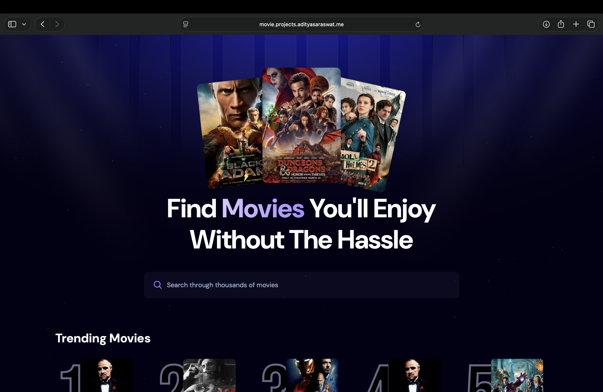
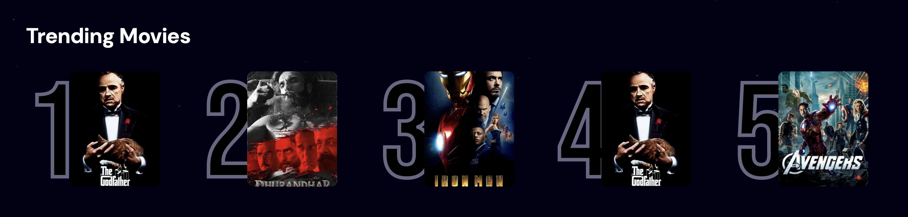
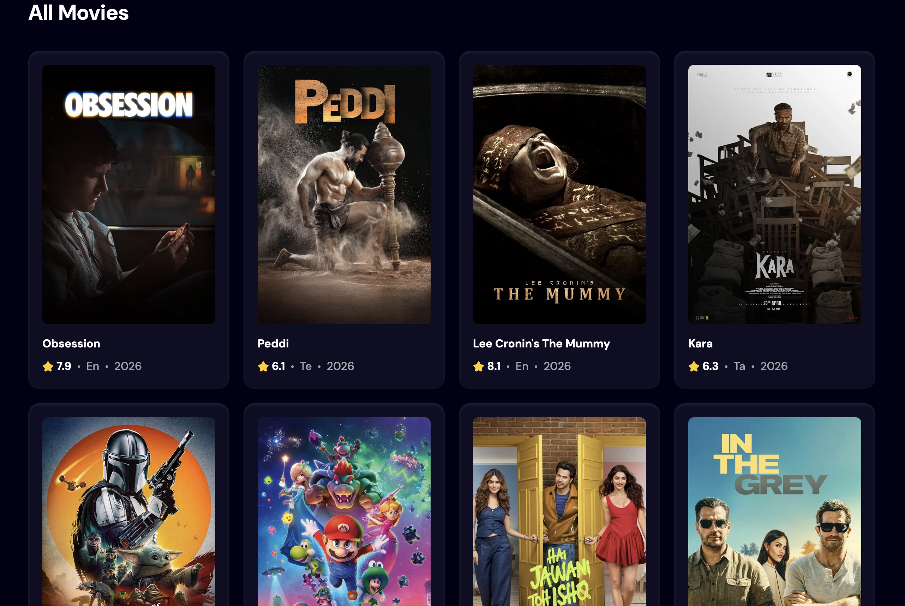
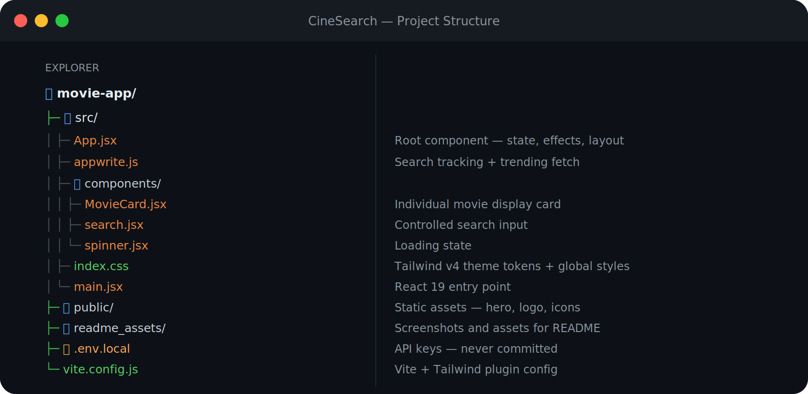
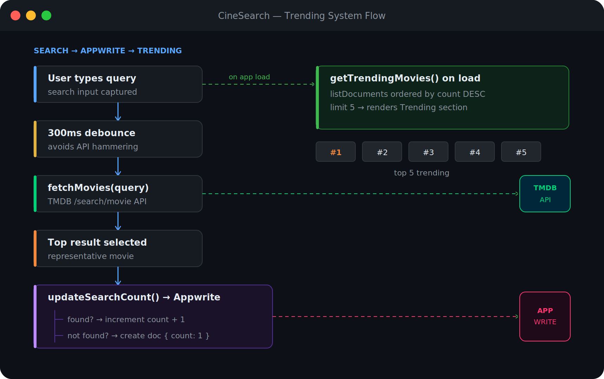

<div align="center">


# 🎬 CineSearch

### *The smarter way to discover movies — powered by what the world is actually watching*

[](https://react.dev)
[](https://vitejs.dev)
[](https://tailwindcss.com)
[](https://appwrite.io)
[](https://www.themoviedb.org)

### 🌐 [Live Demo → movie.projects.adityasaraswat.me](https://movie.projects.adityasaraswat.me)

</div>

---

## ✨ What Makes This Different

Most movie apps show you what's "trending" by some algorithm you can't see or influence. **CineSearch flips that** — the Trending section is built entirely from what real users on the platform are actually searching for, tracked in real-time via Appwrite.

> **Search for "Inception"? It climbs the trending list.**
> **Everyone searching "Interstellar" tonight? It rises to the top.**

The trending section isn't curated — it's *crowdsourced* from live user behavior.


---

## 📸 Screenshots

<div align="center">

### Home Page


<br/>

### Trending Movies — Powered by Real Search Data


> The top 5 most-searched movies, ranked by count from Appwrite's database

<br/>

### All Movies Grid


> Discover movies sorted by popularity, or search through thousands instantly

</div>

---

## 🏗️ Architecture

<div align="center">

</div>

---

## ⚙️ How the Trending System Works

This is the core feature — here's exactly what happens under the hood:

<div align="center">

</div>

---

## 🚀 Getting Started

### Prerequisites

- Node.js 18+
- A [TMDB API key](https://developer.themoviedb.org/docs/getting-started)
- An [Appwrite Cloud](https://cloud.appwrite.io) project with a database + collection

### 1. Clone the repo

```bash
git clone https://github.com/your-username/movie-app.git
cd movie-app
```

### 2. Install dependencies

```bash
npm install
```

### 3. Configure environment variables

Create a `.env.local` file in the project root:

```env
VITE_TMDB_API_KEY=your_tmdb_bearer_token_here
VITE_APPWRITE_PROJECT_ID=your_project_id
VITE_APPWRITE_DATABASE_ID=your_database_id
VITE_APPWRITE_COLLECTION_ID=your_collection_id
```

### 4. Set up Appwrite Collection

In your Appwrite console, create a collection with these attributes:

| Attribute     | Type    | Notes                        |
|---------------|---------|------------------------------|
| `searchTerm`  | String  | The query the user searched  |
| `count`       | Integer | Number of times searched     |
| `movie_id`    | Integer | TMDB ID of the top result    |
| `poster_url`  | String  | Full TMDB image URL          |

### 5. Run locally

```bash
npm run dev
```

Open [http://localhost:5173](http://localhost:5173) and start searching.

---

## 🔑 Key Technical Decisions

| Decision | Choice | Why |
|---|---|---|
| **Debouncing** | `react-use`'s `useDebounce` at 300ms | Prevents API spam while the user is still typing |
| **Trending backend** | Appwrite Cloud (BaaS) | Zero infrastructure — no server, no DB setup, free tier |
| **Image source** | TMDB `w500` CDN | Fast, globally cached, consistent quality |
| **Bundler** | Vite 8 | Near-instant HMR, optimized production builds |
| **Styling** | Tailwind CSS v4 | New CSS-first config, zero runtime overhead |

---

## 📦 Tech Stack

| Layer | Technology |
|---|---|
| **UI Framework** | React 19 |
| **Build Tool** | Vite 8 |
| **Styling** | Tailwind CSS v4 |
| **Backend / DB** | Appwrite Cloud |
| **Movie Data** | TMDB REST API |
| **Utility Hooks** | react-use (`useDebounce`) |

---

## 🔮 What Could Come Next

- [ ] User authentication — personalized watchlists per user
- [ ] Trending by genre — filter what's hot in action, drama, sci-fi
- [ ] Movie detail page with cast, trailer, and full synopsis
- [ ] Infinite scroll / pagination for the all-movies grid
- [ ] PWA support — offline-first, installable on mobile

---

## 📄 License

MIT © 2026 — built with React, Appwrite, and the TMDB API.

<div align="center">